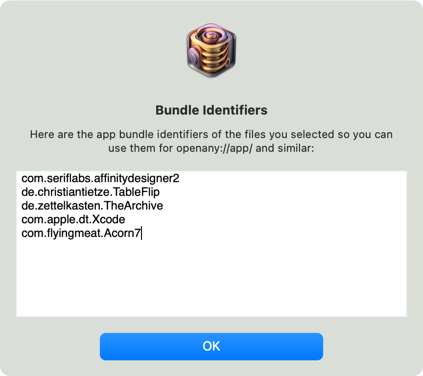

# OpenAny

macOS app and file launcher for simple scripting.

Launches, performs its job, then quits. No long-running processes. No clutter in your menu bar!

## Why?

Any app that renders URLs as clickable links can now become your external app or file launchpad.

- 🎉 Create **open-file-with-app links** anywhere!
- 🌎 Assemble **dashboards** to your projects in your favorite note-taking app!

For example, you can use this in almost any Markdown editor with syntax highlighting to get a clickable link that will open TextEdit:

```md
## My favorite stock macOS apps

TextEdit: <openany://app/com.apple.textedit>
```

That's a very silly example. Why would you want to launch TextEdit in such a complicated way?

Here's a more complicated example: open a file _with a specific app_, with a link.

The default `file://` URLs you get from dragging from Finder are also clickable, but they only _reveal_ the file. Opening the file is an extra step. Boo extra steps!!11

How about embedding a shortcut to edit a file with [TableFlip](https://tableflipapp.com/) and preview with [Marked](https://marked2app.com)?

```md
Preview:     <openany://app/com.brettterpstra.marked2/view?path=~/document.md>
Edit Tables: <openany://app/de.christiantietze.TableFlip/view?path=~/document.md>

... document goes here ...
```

Open any app, or any file, or any file in any app!

## Usage

Powered by the `openany://` URL scheme, you can launch apps and open files!

Open app:

- `openany://app/com.apple.textedit`<br>
  launches TextEdit via its bundle identifier.

Open file:

- `openany://file/open?path=/path/to/file.txt`<br>
  opens `/path/to/file.txt` in your default editor of text files.
- `openany://file/open?url=file:///path/to/file.txt`<br>
  opens `/path/to/file.txt` in your default editor of text files, but using a `file://` URL instead of a path.

Open files with app:

- `openany://app/com.apple.textedit/view?path=/path/to/file.txt`<br>
  opens `/path/to/file.txt` in TextEdit.
- `openany://app/com.apple.textedit/view?url=file:///path/to/file.txt`<br>
  opens `/path/to/file.txt` in TextEdit, but using a `file://` URL instead of a path.
- `openany://file/openwith/com.apple.textedit?path=/path/to/file.txt`<br>
  opens `/path/to/file.txt` in TextEdit.
- `openany://file/openwith/com.apple.textedit?url=file:///path/to/file.txt`<br>
  opens `/path/to/file.txt` in TextEdit, but using a `file://` URL instead of a path.

Reveal file: 

- `openany://file/reveal?path=/path/to/file.txt`<br>
  reveals `/path/to/file.txt` in Finder.
- `openany://file/reveal?url=file:///path/to/file.txt`<br>
  reveals `/path/to/file.txt` in Finder, but using a `file://` URL instead of a path.

## How to get an app's bundle ID



You can drag and drop any app onto the OpenAny application icon to extract its bundle ID.

1. Launch OpenAny directly;
2. Drag apps from Finder to the OpenAny application icon in your dock;
3. Copy the bundle ID out of the dialog, then close it.

> ⚠️ For apps, you need the bundle identifier. PR's welcome for lookup of application by name!

## Why `file://`?!

### Easy parsing reason

the `path=` query parameter works best for files without spaces or any other URL-escaped characters.

For all others, you're better off with a file URL.

### Drag and drop reason

If you drag files from Finder into some apps, they will insert the `file://` into text field. Could be a text editor, a comment field on a calendar event, a note-taking app, a chat window -- you name it. That's how dropping files on macOS can behave.

You can delete the `file://` part to get to the path, of course, but then you have all the URL-escpaed special characters (like `%20` instead of spaces).

It's less annoying to just use the URL by that point. So we do.

## Taxonomy

The URL scheme is comprised of components like this:

    openany://HOST/SUBJECT[/VERB[/OBJECT[?key1=value1[&key2=value2[...]]]]]

When the `HOST` acts as the subject, the pattern becomes: 

    openany://HOST/VERB[/OBJECT[?key1=value1[&key2=value2[...]]]]

The query parameters are called the URL's _payload._

### List of possible `HOST`s

- `app`: Launch an app, identified by `SUBJECT`. That's the bundle identifier.
- `file`: Open a file specified by the payload

### List of possible `SUBJECT` patterns

- For the `app` host:
    - The `SUBJECT` is the app's bundle ID. (Followed by a verb.)
- For the `file` host:
    - `reveal` (acting as `VERB` here), see below.
    - `open` (acting as `VERB` here), see below.
    - `openwith` (acting as `VERB` here), see below.
    - `show` (acting as `VERB` here), see below.

### List of possible `VERB`s

- For the `app` host
    - with `BUNDLE_ID` being the `SUBJECT`:
      - (none): Launches the app. Alias ans shorthand to `launch`.
      - `launch`: `/app/BUNDLE_ID/launch`
      - `view`: `/app/BUNDLE_ID/view` opens a file, specified by the payload, in the app. Alias for `/file/openwith/BUNDLE_ID`.
- For the `file` host:
    - `reveal`: Reveal a file, specified by the payload, in Finder.
    - `open`: Open a file, specified by the payload, in the default app.
    - `openwith`: Open a file, specified by the payload, with the app being the `OBJECT`. Alias for `/app/BUNDLE_ID/view`. Example: `openany://file/openwith/com.apple.textedit?path=/path/to/file.txt` opens `/path/to/file.txt` in TextEdit.
    - `show`: Alias for `reveal`.

### List of possible Payloads

Only used by file-related actions, the payload keys are:

- `path`: As in `?path=/path/to/file.txt`, using an absolute POSIX path. Expands `~` in the path. Most useful for simple paths without e.g. spaces.
- `url`: As in `?url=file:///path/to%20a%file/with%20spaces.txt`, using an absolute `file://` URL, e.g. to easil encode special characters.

If the path or URL point to a directory, Finder will show the directory in a new window. So `/file/open?path=~/Downloads/` is equivalent to /file/reveal?path=~/Downloads/`.
